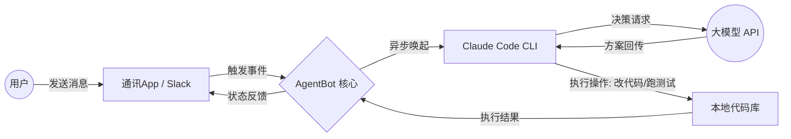

# AgentBot

**AgentBot** 是一个高度可扩展的开源集成框架，旨在打破“本地执行能力”与“远程通讯工具”之间的壁垒。

其核心理念是：**将 AI Agent 的本地系统操作权，延伸至你随身携带的通讯软件中。**


## 🛠 原理架构 (Architecture)

AgentBot 的运作机制可以理解为“大脑、身体与遥控器”的结合：

1. **大脑 (LLM API)**：通过配置 **Claude 3.5 Sonnet**（支持 Anthropic 官方或智谱 GLM 代理接口）提供高逻辑的编程与决策能力。
2. **身体 (Claude Code CLI)**：在本地环境中安装官方 **Claude Code CLI**。它拥有文件系统读写权限、终端指令执行权及 Git 管理权。
3. **遥控器 (AgentBot Connectors)**：本项目（AgentBot）的核心部分。通过接入 **Slack (Bolt)**、Discord 或其他通讯协议，作为一个“桥接插件”监听远程指令。

### 工作流 (Workflow)



---

## 🚀 核心特性

* **跨平台通讯支持**：采用插件化设计，目前首发支持 **Slack (Bolt)**，未来可扩展至 Discord、Telegram、微信等。
* **本地执行力**：不同于常规聊天机器人，本项目直接驱动本地 `claude-code` CLI，能够真正实现：
* 自动修复 Bug 并运行测试。
* 执行 Shell 脚本或系统命令。
* 自动化 Git 提交与代码重构。


* **低成本准入门槛**：完美兼容 **智谱 GLM Coding 套餐**，支持以极低的人民币价格调用顶级 Claude 3.5 编程模型。
* **异步反馈机制**：针对 AI 任务耗时长、通讯 App 响应短的矛盾，内置异步任务处理，确保指令下达后实时追踪进度。

---

## 📋 快速开始

### 1. 准备本地环境

确保你的电脑（或服务器）已安装 Node.js 并在本地配置好 Claude CLI：

```bash
npm install -g @anthropic-ai/claude-code
# 配置 API KEY (支持官方或智谱代理地址)
export ANTHROPIC_API_KEY='your-api-key'

```

### 2. 配置 AgentBot

克隆本项目并安装依赖：

```bash
git clone https://github.com/your-repo/AgentBot.git
cd AgentBot
# 根据你的通讯插件配置环境变量 (以 Slack 为例)
export SLACK_BOT_TOKEN='xoxb-...'
export SLACK_APP_TOKEN='xapp-...'

```

### 3. 运行项目

```bash
python main.py  # 或 npm start

```

---

## 🛡 安全声明

由于 **AgentBot** 赋予了远程指令执行本地代码的权限，建议用户：

* 仅在受信任的隔离环境（如 Docker、虚拟机）中运行。
* 开启 **User ID 白名单验证**，确保只有你本人可以下达高权限指令。
* 在生产环境使用时，配合 `--yes` 参数前务必确认 Prompt 的安全性。

---

