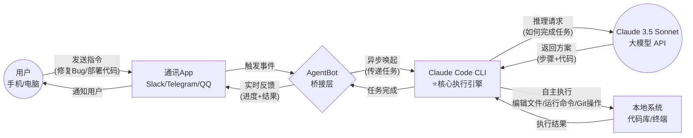

# AgentBot

**AgentBot** 是一个突破性的开源框架，标志着从 **Chat AI** 到 **Agentic AI** 的演进。

传统的聊天机器人只能"对话"，而 AgentBot 通过集成 **Claude Code CLI**，让 AI 真正拥有了"行动力"——它可以在你的电脑上编写代码、执行命令、管理项目，并通过你熟悉的通讯软件（Slack、Telegram 等）随时随地接受指令。

## 💡 核心理念

**将 AI Agent 的本地系统操作权，延伸至你随身携带的通讯软件中。**

这不仅仅是一个聊天机器人，而是一个能够：
- 📝 自主编写和修改代码
- 🔧 执行系统命令和脚本
- 🧪 运行测试并修复 Bug
- 📦 管理 Git 仓库和依赖
- 🤖 完成复杂的多步骤任务

的真正 **Agentic AI 系统**。


## 🛠 原理架构 (Architecture)

### 从 Chat AI 到 Agentic AI 的演进

传统的 **Chat AI**（如 ChatGPT、Claude Web）只能进行对话，无法直接操作你的电脑。而 **Agentic AI** 则具备自主执行任务的能力。

AgentBot 通过三个核心组件实现这一演进：

1. **🧠 大脑 (LLM API)**
   通过配置 **Claude 3.5 Sonnet**（支持 Anthropic 官方或智谱 GLM 代理接口）提供高级推理、编程与决策能力。

2. **🦾 身体 (Claude Code CLI) - 核心执行引擎**
   **这是 AgentBot 的灵魂所在**。官方 **Claude Code CLI** 是 Anthropic 推出的命令行工具，它赋予 AI 真正的"行动力"：
   - ✅ **文件系统操作**：读取、编辑、创建任何文件
   - ✅ **终端命令执行**：运行测试、构建项目、安装依赖
   - ✅ **Git 版本控制**：提交代码、创建分支、管理仓库
   - ✅ **多步骤任务规划**：自主分解复杂任务并逐步执行
   - ✅ **上下文感知**：理解整个项目结构和代码关系

3. **📡 遥控器 (AgentBot Connectors)**
   本项目的桥接层。通过接入 **Slack**、**Telegram**、**QQ**、**WeChat** 等通讯协议，让你可以随时随地通过手机或电脑向本地 AI Agent 下达指令。

### 工作流 (Workflow)



**关键流程说明：**
1. 用户通过通讯 App 发送自然语言指令（如"修复登录页面的 Bug"）
2. AgentBot 接收指令并唤起本地的 Claude Code CLI
3. Claude Code CLI 调用 LLM API 进行任务规划和推理
4. **Claude Code CLI 自主执行**：读取代码、分析问题、编写修复、运行测试
5. 执行结果通过 AgentBot 反馈到通讯 App，用户实时查看进度

---

## 🚀 核心特性

### 🎯 真正的 Agentic AI 能力

不同于传统聊天机器人，AgentBot 通过 **Claude Code CLI** 实现了真正的自主执行能力：

* **🔧 自动化开发任务**
  - 自动修复 Bug 并运行测试验证
  - 重构代码并保持功能一致性
  - 添加新功能并编写相应测试
  - 优化性能并生成性能报告

* **💻 系统级操作权限**
  - 执行任何 Shell 命令或脚本
  - 管理文件系统（读取、编辑、创建、删除）
  - 安装依赖和配置环境
  - 监控系统状态和日志

* **📦 Git 版本控制集成**
  - 自动化 Git 提交和推送
  - 创建和管理分支
  - 解决合并冲突
  - 生成规范的提交信息

### 🌐 跨平台通讯支持

采用插件化设计，支持多种通讯平台：
* ✅ **Slack** (基于 Bolt 框架)
* ✅ **Telegram**
* ✅ **QQ**
* ✅ **WeChat** (微信)
* 🔜 Discord、钉钉等（可扩展）

### 💰 低成本准入门槛

* 完美兼容 **智谱 GLM Coding 套餐**
* 支持以极低的人民币价格调用顶级 Claude 3.5 编程模型
* 也支持 Anthropic 官方 API

### ⚡ 异步任务处理

* 针对 AI 任务耗时长、通讯 App 响应超时的矛盾
* 内置异步任务处理机制
* 实时追踪任务进度并反馈到通讯 App
* 支持长时间运行的复杂任务

---

## 📋 快速开始

### 1. 安装 Claude Code CLI（核心依赖）

**这是最关键的一步**，Claude Code CLI 是 AgentBot 的执行引擎。

#### 安装步骤：

```bash
# 确保已安装 Node.js (v18+)
node --version

# 全局安装 Claude Code CLI
npm install -g @anthropic-ai/claude-code

# 验证安装
claude --version
```

#### 配置 API Key：

**方式 1：使用 Anthropic 官方 API**
```bash
export ANTHROPIC_API_KEY='sk-ant-api03-...'
```

**方式 2：使用智谱 GLM 代理（推荐国内用户）**
```bash
export ANTHROPIC_API_KEY='your-zhipu-api-key'
export ANTHROPIC_BASE_URL='https://open.bigmodel.cn/api/paas/v4/'
```

#### 测试 Claude Code CLI：

```bash
# 在任意项目目录测试
claude "列出当前目录的文件"
```

如果能正常返回结果，说明 Claude Code CLI 已配置成功！

### 2. 安装 AgentBot

克隆本项目并安装依赖：

```bash
git clone https://github.com/your-repo/AgentBot.git
cd AgentBot

# 安装 Python 依赖
pip install -r requirements.txt
```

### 3. 配置通讯平台

创建 `.env` 文件并配置你需要的通讯平台：

```bash
# DeepSeek/Claude API 配置
DEEPSEEK_API_KEY=your-api-key
DEEPSEEK_API_URL=https://open.bigmodel.cn/api/paas/v4/

# Slack 配置（可选）
SLACK_ENABLED=true
SLACK_BOT_TOKEN=xoxb-...
SLACK_APP_TOKEN=xapp-...

# Telegram 配置（可选）
TELEGRAM_ENABLED=false
TELEGRAM_BOT_TOKEN=your-telegram-token

# QQ 配置（可选）
QQ_ENABLED=false

# WeChat 配置（可选）
WECHAT_ENABLED=false
```

### 4. 运行 AgentBot

```bash
python main.py
```

启动后，你会看到类似的输出：

```
=== AgentBot Starting ===
✅ Slack 已启用
✅ 已启用 1 个适配器

AgentBot 正在运行，等待指令...
```

### 5. 开始使用

现在你可以通过配置的通讯 App 向 AgentBot 发送指令了！

**示例指令：**
- "帮我修复 main.py 中的 Bug"
- "运行测试并告诉我结果"
- "创建一个新的 API 接口"
- "优化数据库查询性能"
- "提交当前的代码更改"

AgentBot 会调用 Claude Code CLI 自主完成任务，并实时反馈进度！


---

## 🛡 安全声明

由于 **AgentBot** 通过 **Claude Code CLI** 赋予了远程指令执行本地代码的权限，请务必注意安全：

### ⚠️ 重要安全措施

* **隔离环境运行**：建议在 Docker 容器或虚拟机中运行，避免直接在生产环境主机上运行
* **用户身份验证**：开启 **User ID 白名单验证**，确保只有授权用户可以下达指令
* **权限控制**：Claude Code CLI 拥有完整的文件系统和命令执行权限，请谨慎授权
* **审计日志**：所有操作都会记录日志，便于追溯和审计
* **敏感操作确认**：对于删除文件、修改配置等敏感操作，建议启用二次确认

### 🔒 推荐的安全配置

```bash
# 在 Docker 中运行（推荐）
docker run -v /path/to/workspace:/workspace agentbot

# 配置用户白名单
ALLOWED_USER_IDS=U12345678,U87654321

# 限制工作目录
WORKSPACE_PATH=/path/to/safe/workspace
```

---

## 💡 使用场景

### 场景 1：远程修复 Bug
你在外出差，突然收到线上 Bug 报告。通过手机 Slack 发送指令：
```
"检查 user_service.py 的登录问题并修复"
```
AgentBot 会自动分析代码、定位问题、编写修复、运行测试，并反馈结果。

### 场景 2：自动化部署
需要部署新版本时，只需发送：
```
"运行测试，如果通过则构建并部署到测试环境"
```
Claude Code CLI 会自动执行完整的 CI/CD 流程。

### 场景 3：代码审查助手
```
"审查最近的提交，检查是否有安全漏洞或性能问题"
```
AI 会分析代码并提供详细的审查报告。

### 场景 4：项目初始化
```
"创建一个新的 FastAPI 项目，包含用户认证和数据库集成"
```
自动生成完整的项目结构和代码。

---

